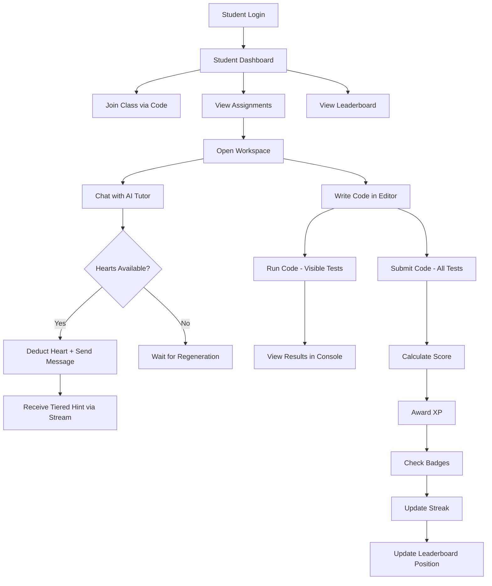
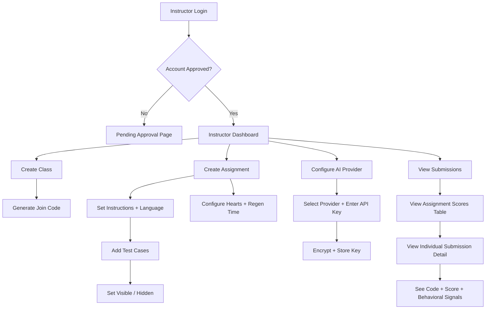
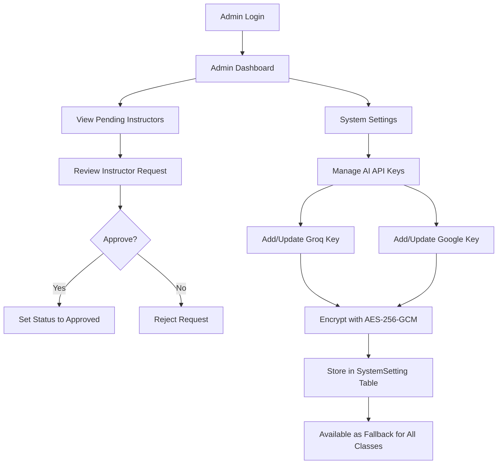
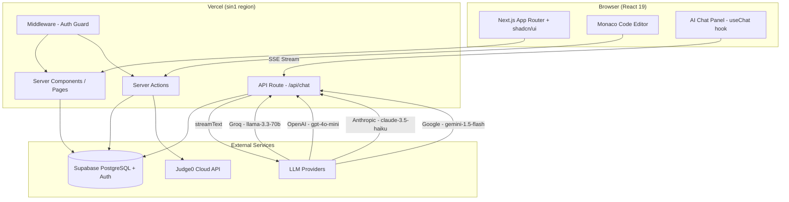
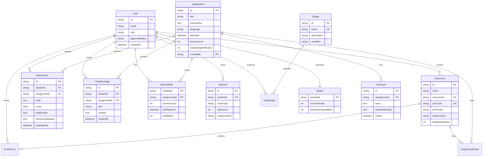
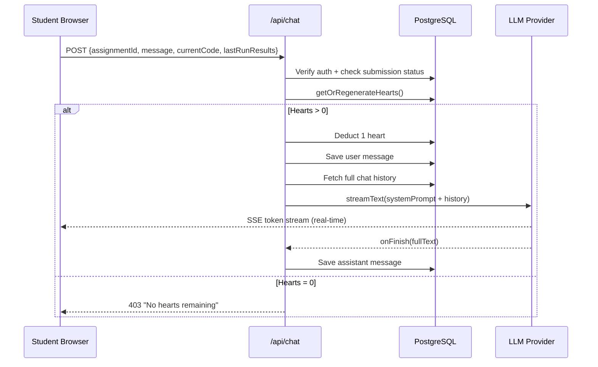
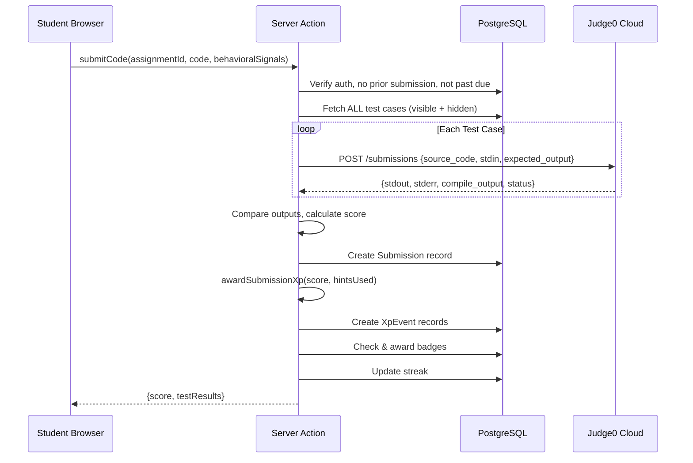
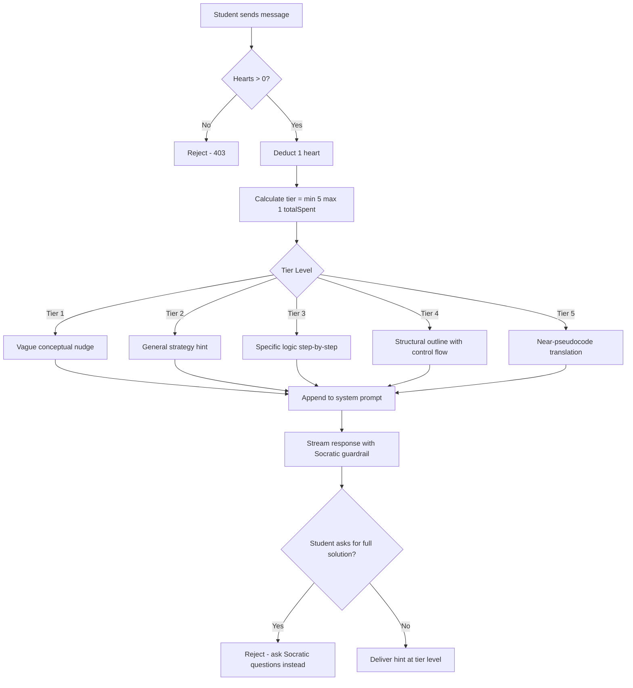
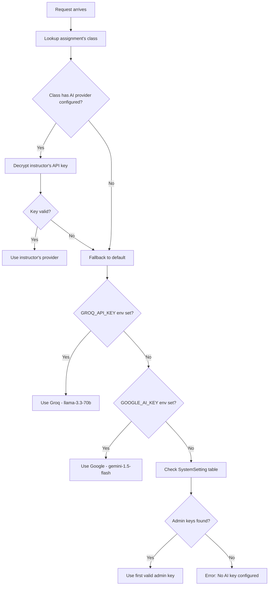

# GAITS — Gamified AI-Assisted Integrated Tutoring System


-black?logo=vercel)


---

## Problem Statement

Traditional programming education lacks:

- **Real-time, personalized guidance** — students get stuck without immediate help
- **Safeguards against plagiarism** — students can easily copy-paste solutions from AI tools
- **Engagement mechanics** — assignments feel repetitive with no progression or reward
- **Scalability** — instructors cannot provide 1-on-1 help to dozens of students simultaneously

---

## Solution

GAITS is a gamified web platform that integrates:

1. **AI Tutor with Tiered Hints** — a hearts-gated, Socratic AI assistant that progressively reveals more detailed guidance as students invest effort
2. **Secure Code Execution** — sandboxed Judge0 environment for running and grading code against visible and hidden test cases
3. **Behavioral Signal Tracking** — monitors paste frequency, keystrokes, typing speed, and focus time to detect academic dishonesty
4. **Gamification Engine** — XP, levels, badges, streaks, and class leaderboards to drive engagement
5. **Role-Based Access** — students, instructors, and admins each with dedicated dashboards and capabilities

---

## App Design

### User Roles & Flows

| Role | Capabilities |
|------|-------------|
| **Student** | Join classes, view assignments, write code in Monaco editor, run tests, chat with AI tutor, submit solutions, earn XP/badges, view leaderboard |
| **Instructor** | Create classes (with join codes), create assignments with test cases, configure AI provider per class, view submissions and scores |
| **Admin** | Approve instructor accounts, manage system-wide AI API keys |

### Key Pages

- `/login`, `/signup` — Authentication with role selection
- `/dashboard/student` — Assignment list, XP/level progress, join class
- `/dashboard/student/assignments/[id]` — Full workspace (editor + AI chat + instructions)
- `/dashboard/student/leaderboard` — Class rankings
- `/dashboard/instructor` — Class management, assignment creation
- `/dashboard/instructor/submissions` — Grade overview and detailed submission view
- `/dashboard/admin` — Instructor approvals and API key settings

### Student Data Flow



### Instructor Data Flow



### Admin Data Flow



---

## Architecture Design

### High-Level System Architecture



### Database Entity Relationship Diagram



### Request Flow — AI Tutor Chat



### Request Flow — Code Execution & Submission



---

## Detailed Framework Diagram

```mermaid
graph LR
    subgraph Frontend["Frontend Layer"]
        direction TB
        NextApp[Next.js 16 App Router]
        ShadcnUI[shadcn/ui Components]
        Monaco[Monaco Editor]
        AIChat[useChat - @ai-sdk/react]
        TailwindCSS[Tailwind CSS v4]
    end

    subgraph Backend["Backend Layer"]
        direction TB
        ServerActions[Server Actions]
        APIRoutes[API Routes]
        Middleware[Auth Middleware]
        PrismaORM[Prisma ORM v7]
    end

    subgraph Services["External Services"]
        direction TB
        SupabaseAuth[Supabase Auth]
        SupabaseDB[(Supabase PostgreSQL)]
        Judge0API[Judge0 Cloud CE]
        GroqAI[Groq - Llama 3.3 70B]
        GoogleAI[Google - Gemini 1.5 Flash]
        OpenAI[OpenAI - GPT-4o Mini]
        AnthropicAI[Anthropic - Claude 3.5 Haiku]
    end

    subgraph Security["Security Layer"]
        direction TB
        AES[AES-256-GCM Encryption]
        RateLimit[Rate Limiting - 5 req/min]
        RoleGuard[Role-Based Access Control]
        IntentGuard[AI Intent Guardrail]
    end

    Frontend --> Backend
    Backend --> Services
    Security -.-> Backend
```



---

## Algorithms

### 1. Tiered Hint Algorithm

The AI tutor uses a progressive disclosure model based on hearts spent:



### 2. Hearts Regeneration Algorithm

```
function getOrRegenerateHearts(studentId, assignmentId):
    state = DB.find(studentId, assignmentId)
    if state is null:
        state = DB.create(studentId, assignmentId, count=maxHearts)
        return state

    if state.currentCount >= maxHearts:
        return state

    elapsed = now() - state.lastRegenAt
    cooldown = assignment.heartsRegenMinutes * 60 * 1000
    heartsToRestore = floor(elapsed / cooldown)

    if heartsToRestore > 0:
        newCount = min(maxHearts, state.currentCount + heartsToRestore)
        state.currentCount = newCount
        state.lastRegenAt = lastRegenAt + (heartsToRestore * cooldown)
        DB.update(state)

    return state
```

### 3. XP Award Algorithm

```
function awardSubmissionXp(student, assignment, score, hintsUsed):
    xpEvents = []

    // Proportional XP for passing test cases
    if score > 0:
        caseXp = round((score / 100) * 50)
        xpEvents.push({type: "pass_case", amount: caseXp})

    // Perfect score bonus
    if score == 100:
        xpEvents.push({type: "perfect_score", amount: 50})

    // Hint efficiency bonuses
    if hintsUsed == 0:
        xpEvents.push({type: "no_hints", amount: 30})
    else if hintsUsed <= 2:
        xpEvents.push({type: "few_hints", amount: 15})

    // Streak bonus (weekly cadence)
    currentWeek = getISOWeek(now())
    if streak.lastSubmissionWeek == currentWeek - 1:
        streak.currentStreak += 1
        xpEvents.push({type: "streak", amount: 20})
    else if streak.lastSubmissionWeek != currentWeek:
        streak.currentStreak = 1

    // Badge checks
    checkAndAwardBadges(student, totalXp, streak, submissions)

    return xpEvents
```

### 4. Code Execution Scoring Algorithm

```
function scoreSubmission(code, language, testCases):
    results = []
    for each testCase in testCases:
        response = Judge0.submit({
            source_code: code,
            language_id: LANGUAGE_MAP[language],
            stdin: testCase.input,
            expected_output: testCase.expectedOutput,
            cpu_time_limit: 10
        })

        passed = normalize(response.stdout) == normalize(testCase.expectedOutput)
        results.push({testCase, passed, stdout, stderr, compileOutput})

    score = (results.filter(r => r.passed).length / results.length) * 100
    return {score, results}

function normalize(output):
    return output.trim().replaceAll("\r\n", "\n")
```

### 5. AI Provider Fallback Algorithm



---

## Gamification Design

### Level Progression

| Level | XP Required | Cumulative |
|-------|-------------|------------|
| 1 | 0 | 0 |
| 2 | 100 | 100 |
| 3 | 250 | 250 |
| 4 | 500 | 500 |
| 5 | 800 | 800 |
| 6 | 1,200 | 1,200 |
| 7 | 1,700 | 1,700 |
| 8 | 2,300 | 2,300 |
| 9 | 3,000 | 3,000 |
| 10 | 4,000 | 4,000 |
| 11 | 5,000 | 5,000 |

### Badges

| Badge | Condition |
|-------|-----------|
| First Submit | Complete first assignment submission |
| Perfect Score | Score 100% on any assignment |
| Five Perfect | Score 100% on 5 assignments |
| Streak 5 | Maintain 5-week submission streak |
| Streak 10 | Maintain 10-week submission streak |
| XP 1000 | Accumulate 1,000 total XP |
| XP 5000 | Accumulate 5,000 total XP |

---

## Tech Stack Summary

| Layer | Technology |
|-------|-----------|
| Frontend | Next.js 16, React 19, TypeScript 5, Tailwind CSS 4, shadcn/ui |
| Code Editor | Monaco Editor (@monaco-editor/react) |
| AI Chat | Vercel AI SDK (useChat + streamText) |
| Backend | Next.js Server Actions + API Routes |
| Database | PostgreSQL via Supabase |
| ORM | Prisma 7 (with @prisma/adapter-pg) |
| Auth | Supabase Auth (email/password + role metadata) |
| Code Execution | Judge0 Cloud API (sandboxed) |
| AI Providers | Groq, OpenAI, Anthropic, Google (multi-provider with fallback) |
| Encryption | AES-256-GCM (for API keys at rest) |
| Deployment | Vercel (Singapore region) |

---

## Getting Started

### Prerequisites

- Node.js 18+
- PostgreSQL (or Supabase project)
- Judge0 Cloud API access
- At least one LLM API key (Groq recommended)

### Environment Variables

Copy `.env.example` and fill in:

```bash
DATABASE_URL=
NEXT_PUBLIC_SUPABASE_URL=
NEXT_PUBLIC_SUPABASE_ANON_KEY=
SERVICE_ROLE_KEY=
ENCRYPTION_KEY=
GROQ_API_KEY=
GOOGLE_GENERATIVE_AI_API_KEY=
JUDGE0_API_KEY=
```

### Development

```bash
npm install
npx prisma generate
npx prisma db push
npm run dev
```

Open [http://localhost:3000](http://localhost:3000).

### Production Build

```bash
npx prisma generate && next build
```

---

## Project Structure

```
fr-gaits/
├── app/
│   ├── layout.tsx              # Root layout (fonts, Toaster)
│   ├── page.tsx                # Root redirect
│   ├── login/                  # Login page
│   ├── signup/                 # Signup page
│   ├── pending-approval/       # Instructor waiting page
│   ├── dashboard/
│   │   ├── student/            # Student dashboard + workspace
│   │   ├── instructor/         # Instructor dashboard + submissions
│   │   └── admin/              # Admin dashboard + settings
│   ├── actions/                # Server actions
│   └── api/chat/               # AI tutor streaming endpoint
├── components/
│   ├── ui/                     # shadcn/ui primitives
│   └── features/               # Domain feature components
├── lib/                        # Core utilities (prisma, AI, auth, gamification)
├── prisma/schema.prisma        # Database schema
├── proxy.ts                    # Auth middleware
└── vercel.json                 # Deployment config
```
